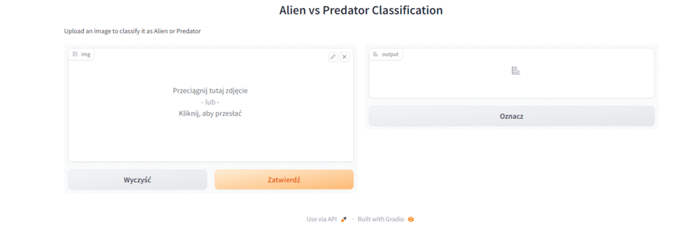

## Alien vs Predator Computer Vision Classification

The Alien vs Predator project is a computer vision project that aims to classify images of two popular sci-fi characters, Alien and Predator. The project uses deep learning techniques to build an image classification model that can accurately identify whether an image contains an Alien or a Predator.

## Dataset
The dataset used in this project was obtained from a [Kaggle](https://www.kaggle.com/datasets/pmigdal/alien-vs-predator-images) and contains a total of 694 images of Aliens and Predators. The dataset was split into training, validation, and test sets, with 590, 104, and 200 images, respectively.

## The repository contains:
* alien vs predator presentation.pdf  -final presentation with introduction, goal, bussiness aspect, models, results
* alien_vs_predator.ipynb  -notebook include data loading, preprocessing, modeling and final Gradio app
* data.zip  -dataset 
* photo_gif.gif  =gif
* photo_gead.png  -header

## Alien vs predator app
The application you have here is an "Alien vs Predator" image classifier. It uses a pre-trained model to classify uploaded images as either "Alien" or "Predator". 

When you run the application, it will provide you with an interface where you can upload an image. Once you upload an image, the application will preprocess the image by resizing it and applying the same preprocessing steps as in the data generator. It will then pass the preprocessed image through the pre-trained model to make a prediction. The predicted class (either "Alien" or "Predator") will be displayed as the output label.

Feel free to give it a try by uploading your own images and see how the model classifies them as either "Alien" or "Predator"! Enjoy exploring the "Alien vs Predator" classification app.

## How to Run the Project and app?
To open the project, use the git clone command or download alien_vs_predator.ipynb.
To run the application, you need to download and execute the "alien_vs_predator.ipynb" notebook. At the end of the notebook, in the Gradio app section, there is a code snippet that, when executed, launches the application interface. Make sure you have all the required dependencies installed and execute the notebook from top to bottom. Once you reach the Gradio app section, run the code to start the application interface.
